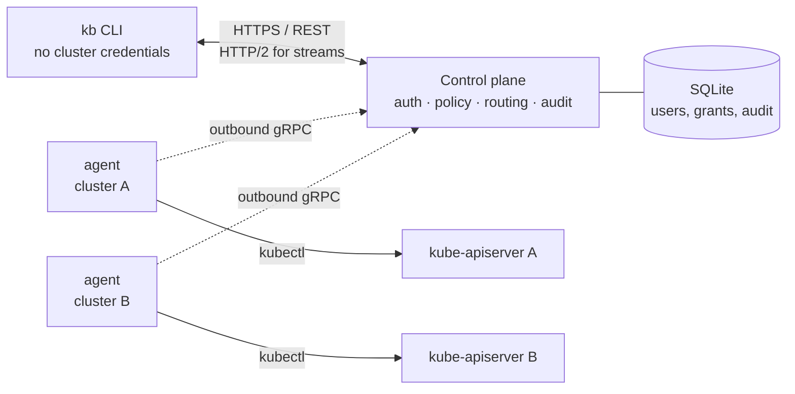
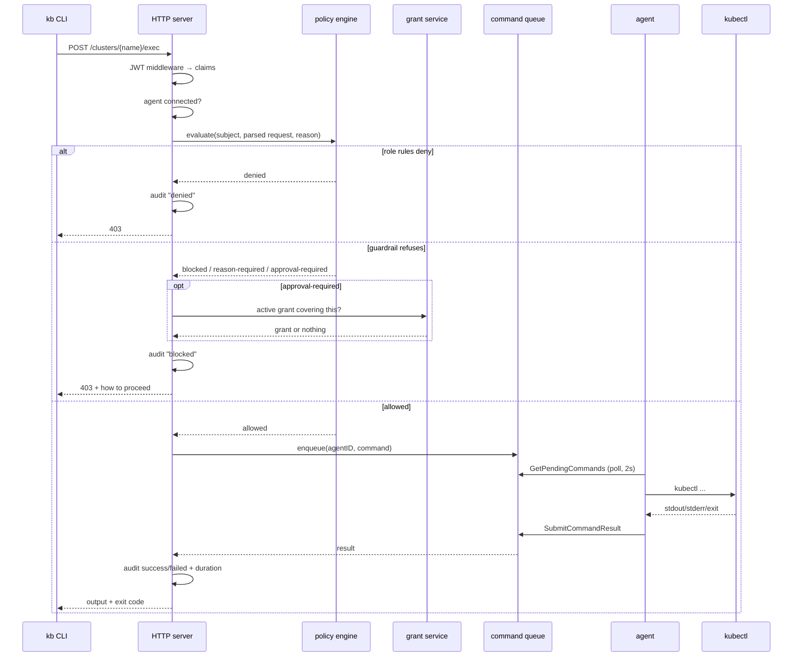
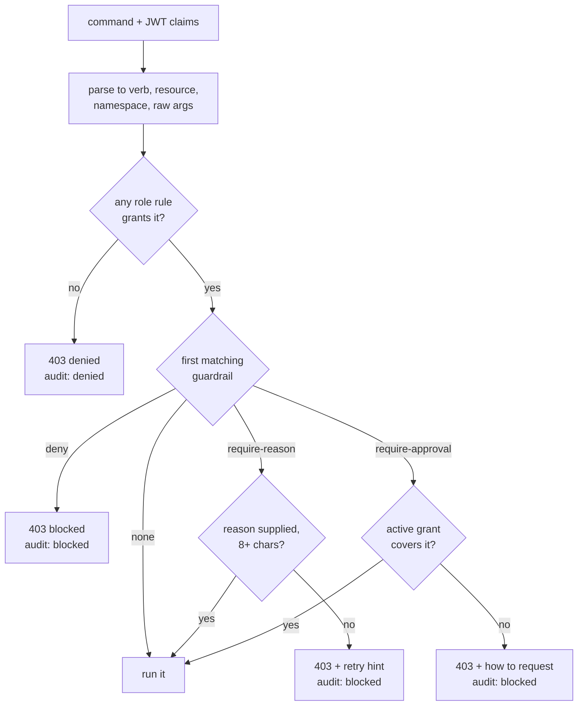
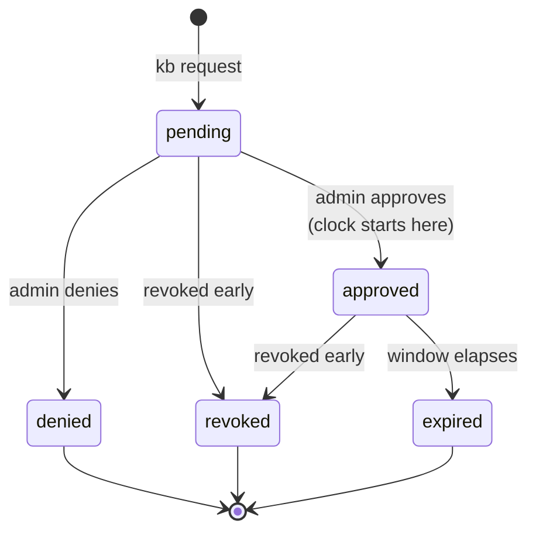

# Architecture

How kbridge is put together, for anyone reading the code or reviewing the design.
For endpoint shapes see [api.md](api.md); for the hardening checklist and the
two-layer authorization model see [security.md](security.md).

## The shape of it

Three processes. The user runs a CLI that holds no cluster credentials. Each
cluster runs an agent that holds the Kubernetes credentials and **dials out**. A
control plane sits between them, deciding what may run and recording what did.



Two properties follow from the direction of the arrows:

- **No inbound path into a cluster.** The agent opens the connection, so no
  firewall rule, bastion, VPN, or public API-server endpoint is needed.
- **Credentials stay where the work happens.** The control plane never holds a
  kubeconfig. Compromising it does not hand an attacker cluster credentials,
  because there are none to take.

## Package map

```
cmd/kb                  CLI entry point (binary `kb`, `kbridge` symlink)
cmd/controlplane        control plane entry point
cmd/agent               agent entry point

internal/policy         authorization domain: no transport, no storage
internal/controlplane   HTTP + gRPC servers, store, session routing, audit
internal/agent          gRPC client, kubectl execution, PTY, port-forward
internal/auth           JWT issue/verify, bcrypt, Gin middleware
internal/execframe      frame codec for interactive exec
internal/pfframe        frame codec for port-forward
api/proto/agentpb       generated gRPC code (never edited by hand)
```

One dependency rule matters: **`internal/policy` imports nothing heavy.** It has
no Gin, no gRPC, no database driver. That is what lets the CLI link it and
evaluate a policy file offline, which is how `kb policy test` runs in CI without
a control plane. `internal/controlplane/policy.go` is a thin alias shim so the
server's call sites still read naturally.

Changing `api/proto/agent.proto` means running `make proto`. The generated
package is not hand-edited.

## Request lifecycle

A one-shot command, which is the common case:



The CLI exits with the remote kubectl's exit code, so scripts behave as they
would locally.

**Dispatch detail.** `kb` is kubectl-by-default: any first argument that is not a
management command is treated as kubectl, so `kb get pods` works with no
`kubectl` keyword. The management set is `login`, `logout`, `status`, `clusters`
(alias `cluster`), `policy`, `request`, `grants`, and `admin`, plus the explicit
escape hatches `kubectl` and `k` and Cobra's own `help` and `completion`. The
rewrite happens in `internal/cli/dispatch.go` before Cobra parses anything, which
is also why `--reason` has to be stripped there rather than declared as a flag.

## The four command paths

One-shot queue-and-poll is only one of four transports. Which one runs is decided
by the CLI from the command itself.

| Path | Trigger | CLI to control plane | Control plane to agent | Agent |
|---|---|---|---|---|
| **One-shot** | anything else | `POST .../exec`, JSON in, JSON out | queue, agent polls every 2s | `kubectl` to completion |
| **Streaming** | `-f`, `--follow`, `-w`, `--watch` | `POST .../stream`, chunked response | persistent bidirectional gRPC stream | `kubectl` with output pumped as it appears |
| **Interactive** | `exec` with `-i` or `-t` | `POST .../exec/attach`, HTTP/2 bidirectional frames | same gRPC stream, `StdinData` and `Resize` messages | real PTY, SIGWINCH resize |
| **Port-forward** | `port-forward` | `POST .../port-forward`, HTTP/2 bidirectional frames | same gRPC stream, per-connection messages | `kubectl port-forward`, one local dial per connection |

The three long-lived paths share one mechanism: the agent opens a single
`OpenStream` gRPC connection at startup, and the control plane multiplexes every
session over it by session ID. That is why an agent needs exactly one outbound
connection no matter how many people are streaming through it.

### Frame codecs

The two bidirectional paths need to carry distinct message kinds over one byte
stream, so each has a small length-prefixed codec. `pfframe` reuses `execframe`'s
wire framing and only defines its own message types, so there is one framing
implementation and one 1 MiB payload cap to reason about.

`internal/execframe`, for interactive exec:

| Type | Direction | Payload |
|---|---|---|
| `Stdin` `0x00` | CLI to control plane | raw bytes |
| `Resize` `0x01` | CLI to control plane | rows, cols as big-endian uint16 |
| `Stdout` `0x10` | control plane to CLI | raw bytes |
| `Stderr` `0x11` | control plane to CLI | raw bytes |
| `Exit` `0x12` | control plane to CLI | exit code int32, optional message |

`internal/pfframe`, for port-forward, which additionally needs to distinguish
*which* of several TCP connections a byte belongs to:

| Type | Direction | Payload |
|---|---|---|
| `Open` `0x01` | CLI to control plane | conn id, remote port |
| `Data` `0x02` | both | conn id, raw bytes |
| `Close` `0x03` | both | conn id |
| `ConnError` `0x04` | control plane to CLI | conn id, message |
| `Ready` `0x05` | control plane to CLI | none |
| `SessionError` `0x06` | control plane to CLI | message |

Both codecs are transport-agnostic, which is why the relay logic is unit-tested
over in-memory pipes rather than needing a live cluster.

## Authorization pipeline

Every path funnels through one function, `authorizeExec`. There is no second
authorization route to keep in sync, which is deliberate: a new command path
inherits the full decision for free.



Three things worth noting about the ordering:

1. **Role rules decide first.** A command no role grants is denied before any
   guardrail is consulted, so a guardrail can never widen access.
2. **Guardrails see the command, not just the API call.** Because kbridge holds
   the argument list, a guardrail can separate `delete pod api-0` from
   `delete pod --all`, and `apply` from `apply --dry-run=server`. Cluster-side
   RBAC cannot express either distinction. This is what makes prevention
   possible rather than only recording.
3. **Grants are dynamic state, so they live outside the policy package.** The
   policy engine returns `approval-required` and the control plane checks for a
   covering grant. Keeping that lookup out of `internal/policy` is what preserves
   the offline-evaluation property.

The policy file is hot-reloaded: the engine watches the containing directory and
swaps an `atomic.Pointer` on change, and `SIGHUP` forces a reload for
filesystems that do not deliver inotify events. A file that fails to parse is
logged and the previous policy stays active, so a bad edit never disables
enforcement.

## Just-in-time access

A `require-approval` guardrail is satisfied only by a grant someone else
approved.



Two design choices shape this:

- **The clock starts at approval, not request.** A pending grant carries no
  expiry at all, so a request sitting in a queue overnight does not burn its own
  window.
- **Expiry is derived, never stored as a status.** A grant is live only while it
  is approved *and* the current time is before its expiry. Nothing has to flip a
  row, so there is no background job to fail and no window where an expired
  grant still authorizes. "Expired" exists only as a rendering.

`grant_id` on the exec request is server-side only. A client that sends one is
ignored, because a client asserting its own approval would defeat the point.

## Data model

SQLite, with the driver behind a `Store` interface so another engine can be
added without touching the handlers.

| Table | Holds |
|---|---|
| `users` | email, bcrypt hash, active and admin flags |
| `clusters` | name, status, agent id, last seen |
| `agent_tokens` | HMAC-SHA256 hash with a server-side pepper, prefix, revoked flag, expiry |
| `refresh_tokens` | hash, expiry, owner |
| `grants` | subject, scope, status, reason, window, decision, expiry |
| `audit_logs` | user, cluster, command, status, exit code, duration, client IP, reason, grant id |

Migrations are plain idempotent SQL: `CREATE TABLE IF NOT EXISTS` for new tables,
plus a list of added columns applied with `ALTER TABLE` where "already exists" is
treated as success. That means an existing database upgrades in place on startup,
and the path is covered by a test that builds the old schema and migrates it.

Live command routing uses an in-memory agent registry and command queue; the
database is the durable record, not the hot path.

## Trust model

Worth being precise about what each compromise buys an attacker, because the
answer shapes what the roadmap is for.

| If this is compromised | The attacker can | The attacker cannot |
|---|---|---|
| A user's laptop | Use that user's token until it expires, within their policy | Exceed their policy; act as anyone else |
| An agent token | Register as that one cluster | Touch any other cluster; a token is bound to one |
| The agent process | Do whatever its Kubernetes ServiceAccount permits | Exceed that ServiceAccount, which is the hard ceiling |
| **The control plane** | **Direct agents to run commands the policy should have refused, up to the agent's ServiceAccount** | Obtain cluster credentials, which it never holds |

That fourth row is the honest limitation today: the control plane is the judge,
and a corrupt judge lets people through. Three things bound the damage, and two
of them are planned work.

1. **Shipped.** The agent's ServiceAccount is an absolute ceiling. Scoping it
   tightly, as [security.md](security.md) describes, is the single most effective
   control available now.
2. **Planned.** Agent-side hard denies: a small policy the agent enforces itself,
   owned by the cluster operator and invisible to the control plane, so a
   compromised control plane cannot lift it.
3. **Planned.** Signed commands with impersonation: the user signs each request
   with a key only they hold and the agent verifies it, then runs the command as
   that user in Kubernetes. A compromised control plane could then refuse
   commands but not forge one, and the cluster's own RBAC becomes the final
   judge. See [ROADMAP.md](../ROADMAP.md).

## Concurrency and limits

| Bound | Default | Purpose |
|---|---|---|
| `streams.max_concurrent` | 50 | Caps live streaming, interactive, and port-forward sessions together; exceeding it returns 429 |
| Request body limit | 1 MiB | On non-streaming routes |
| Frame payload | 1 MiB | Both codecs |
| Command timeout | 30s default, 5m max | Per one-shot command |
| Agent poll | 2s | How often an agent asks for queued work |
| Heartbeat | 30s, server-directed | The control plane returns the next interval in its response, so it can slow agents down without redeploying them |
| Disconnect sweep | 15s | How often the control plane marks silent agents disconnected |
| Login rate limit | 5 per minute, burst 5 | Per client |

A client disconnect cancels its session through context cancellation, and the
agent's child process is killed rather than orphaned.

## Configuration

Every component follows one pattern:

```
DefaultConfig() → LoadConfig(path) → resolve secrets → Validate()
```

Secrets resolve from, in precedence order, a `_FILE` environment variable, a
plain environment variable, a `*_file` config key, then an inline value. That
applies to the JWT secret, the agent-token pepper, the admin password, and each
notification webhook URL and signing secret. Mounting a secret from a file is
therefore always possible, which is what the Helm charts do.

A short secret fails startup rather than running insecurely.

## Where to start reading

| To understand | Read |
|---|---|
| The authorization decision | `internal/policy/decision.go`, then `guardrails.go` |
| How a command is routed | `internal/controlplane/http.go`, `authorizeExec` |
| Stream multiplexing | `internal/controlplane/stream_manager.go` |
| The bidirectional relays | `internal/controlplane/exec_http.go`, `portforward_http.go` |
| Agent execution | `internal/agent/executor.go` |
| Grant lifecycle | `internal/controlplane/grants.go` |
| CLI dispatch | `internal/cli/dispatch.go`, then `kubectl.go` |
